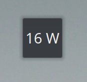
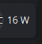
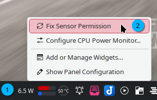

# Power Monitor
Another stupidly simple KDE Plasma 6 widget to monitor the power consumption of your CPU (only) in real time.

This is a fork of [Power Monitor](https://github.com/atul-g/plasma-power-monitor). The original measures the battery power consumption while this extension measures only <b>Intel</b> CPU's power.

## Preview
Widget on the desktop

Widget on the taskbar

## Installation

To install this:

1. Right click on the desktop
2. Click on `Enter Edit Mode`, then select `Add or Manage Widgets`
4. Select `Get New`, then select `Download New Plasma Widgets`
5. Search for `CPU Power Monitor` and click Install.

## Usage

Drag and drop the widget from the `Add or Manage Widgets` either to the desktop or taskbar.

## Customization

1. Update Interval: Changes the rate at which the widget updates.
2. Bold Text: Changes display text to <b>Bold</b>
3. Choose RaplPath. You can find them in /sys/class/powercap/. Look for energy_uj.

### Note
1. The widget displays power consumption in Watts.
2. This widget makes use of the `/sys/class/powercap/intel-rapl:0/energy_uj` sysfs interface to query energy consumption. If the widget displays "FX-PR", then 
    * your processor doesn't support this interface, or
    * don't have the permission to read the said file.
3. If later is the case, right click the widget and select `Fix Sensor Permission`. Enter the superuser password when prompted. (Temporary, resets on reboot)
    
